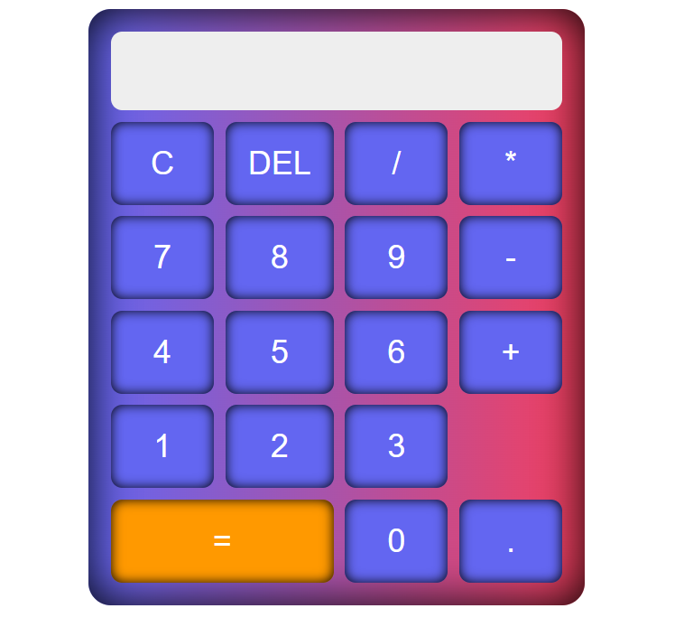
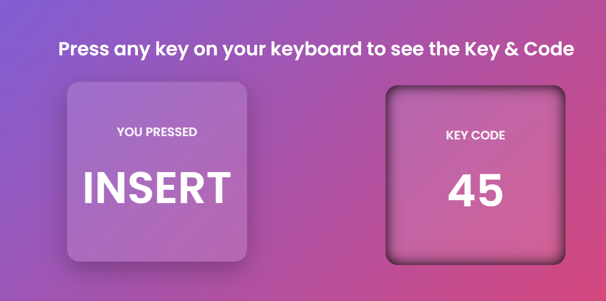
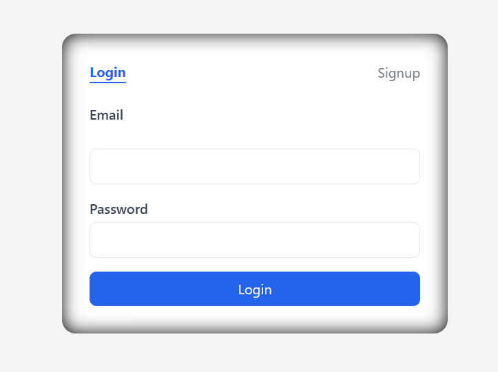
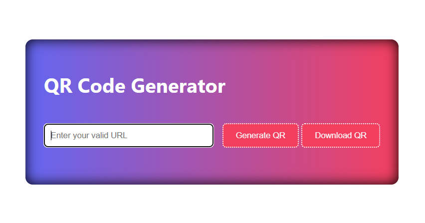
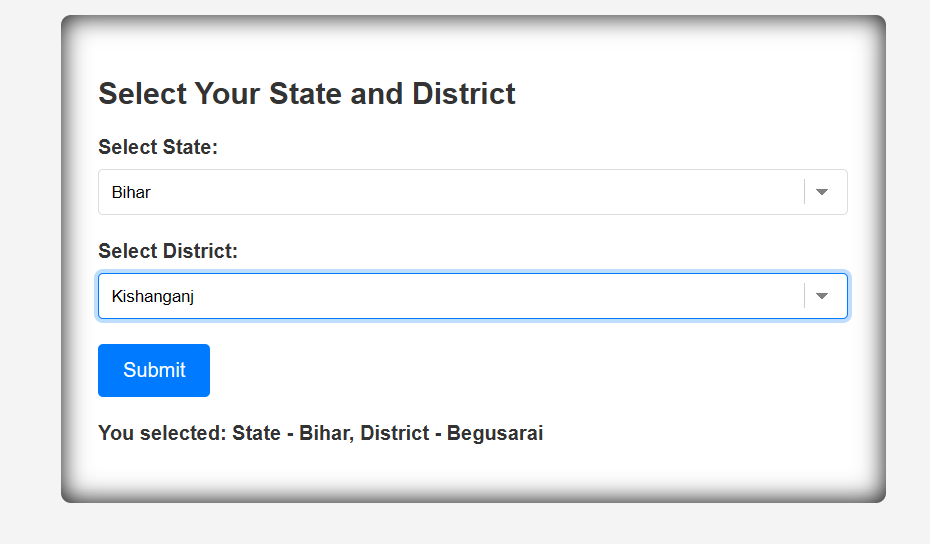
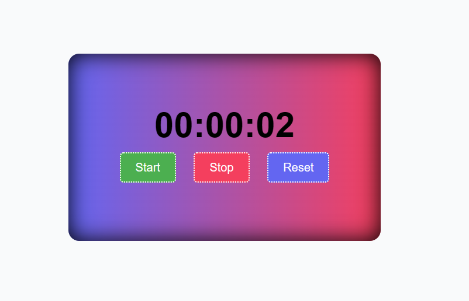
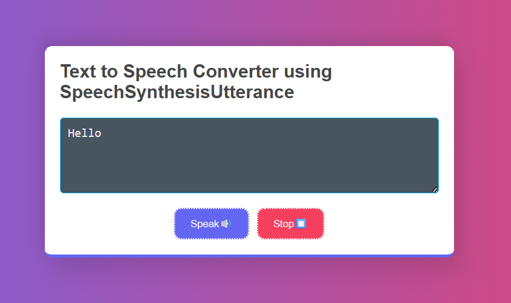
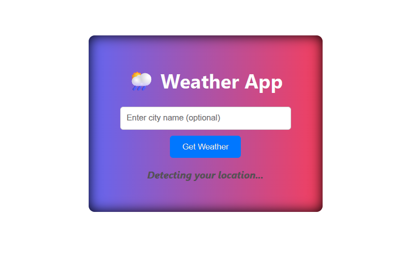

# Beginners JavaScript Projects

Welcome to the **Beginners JavaScript Projects** repository! This collection contains simple, beginner-friendly JavaScript projects that help you learn and practice core JavaScript concepts.

## Projects Included

<table width="100%" border="1">

<tr>
   <td width="20%">1️⃣Calculator</td>
   <td width="30%"> A basic calculator that performs addition, subtraction, multiplication, and division. </td>
   <td width="20%"></td>
   <td width="20%">
    <a href="https://download-directory.github.io/?url=https://github.com/Pankajdas0025/Beginners-JavaScript-projects/tree/main/Calculator">🔗Download </a>
    <a href="https://pankajdas0025.github.io/Beginners-JavaScript-projects/Calculator/"> 👁️view </a></td>
</tr>

<tr>
   <td width="20%">2️⃣2️Keycode Finder </td>
   <td width="30%"> Learn and experiment with keyboard events in JavaScript. Press keys and see their key codes in action.</td>
   <td width="20%"></td>
   <td width="20%">
    <a href="https://download-directory.github.io/?url=https://github.com/Pankajdas0025/Beginners-JavaScript-projects/tree/main/Keycode">🔗Download </a>
    <a href="https://pankajdas0025.github.io/Beginners-JavaScript-projects/Keycode/"> 👁️view </a></td>
</tr>
   <tr>
   <td width="20%">3️⃣Login-Page</td>
   <td width="30%"> A simple login page to understand form handling and basic client-side validation.</td>
   <td width="20%"></td>
   <td width="20%">
    <a href="https://download-directory.github.io/?url=https://github.com/Pankajdas0025/Beginners-JavaScript-projects/tree/main/Login-Page">🔗Download </a>
   <a href="https://pankajdas0025.github.io/Beginners-JavaScript-projects/Login-Page/"> 👁️view </a></td>
</tr>

<tr>
   <td width="20%">4️⃣QR-Code-Geenerator</td>
   <td width="30%"> Generat QR codes dynamically using JavaScript. Perfect for learning how to integrate libraries and APIs.</td>
   <td width="20%"></td>
   <td width="20%">
    <a href="https://download-directory.github.io/?url=https://github.com/Pankajdas0025/Beginners-JavaScript-projects/tree/main/QR-Code-Generator">🔗Download </a>
   <a href="https://pankajdas0025.github.io/Beginners-JavaScript-projects/QR-Code-Generator/"> 👁️view </a></td>
</tr>

<tr>
   <td width="20%">5️⃣StateDistrict</td>
   <td width="30%">Select dropdown of districts from all indian state .</td>
   <td width="20%"></td>
   <td width="20%">
    <a href="https://download-directory.github.io/?url=https://github.com/Pankajdas0025/Beginners-JavaScript-projects/tree/main/StateDistrict">🔗Download </a>
    <a href="https://pankajdas0025.github.io/Beginners-JavaScript-projects/StateDistrict/"> 👁️view </a></td>
</tr>

<tr>
   <td width="20%">6️⃣Snake Game </td>
   <td width="30%"> A simple snake game using javascript looping and conditional statement</td>
   <td width="20%"></td>
   <td width="20%">
    <a href="https://download-directory.github.io/?url=https://github.com/Pankajdas0025/Beginners-JavaScript-projects/tree/main/StateDistrict">🔗Download </a>
   <a href="https://pankajdas0025.github.io/Beginners-JavaScript-projects/Snake-Game/"> 👁️view </a> </td>
</tr>

<tr>
    <td width="20%" >7️⃣Stopwatch Timer </td>
    <td  width="30%" > Build a digital stopwatch with start, stop, and reset functionalities. Learn about timing functions in JS.</td>
   <td width="20%"></td>
    <td  width="20%" >
     <a href="https://download-directory.github.io/?url=https://github.com/Pankajdas0025/Beginners-JavaScript-projects/tree/main/Stopwatch">🔗Download </a>
     <a href="https://pankajdas0025.github.io/Beginners-JavaScript-projects/Stopwatch/"> 👁️view </a></td>
</tr>

<tr>
   <td  width="20%" >8️⃣ Text-to-Speech-Converter</td>
   <td  width="30%" > Convert typed text to speech using JavaScript's Web Speech API. Fun project for practicing browser APIs.</td>
   <td width="20%"></td>
   <td  width="20%" >
    <a href="https://download-directory.github.io/?url=https://github.com/Pankajdas0025/Beginners-JavaScript-projects/tree/main/Text-to-Speech-Converter">🔗Download </a>
   <a href="https://pankajdas0025.github.io/Beginners-JavaScript-projects/Text-to-Speech-Converter/"> 👁️view </a></td>
</tr>

<tr>

   <td width="20%">9️⃣ Simple Weather App</td>
   <td width="30%"> A simple weather application using JavaScript and a public API to fetch real-time weather information.</td>
   <td width="20%"></td>
   <td width="20%">
    <a href="https://download-directory.github.io/?url=https://github.com/Pankajdas0025/Beginners-JavaScript-projects/tree/main/WheatherApp">🔗Download </a>
    <a href="https://pankajdas0025.github.io/Beginners-JavaScript-projects/WheatherApp/"> 👁️view </a></td>

</tr>
</table>

<!--
https://download-directory.github.io/?url=https://github.com/Pankajdas0025/Beginners-JavaScript-projects/tree/main/Calculator

https://download-directory.github.io/?url=https://github.com/Pankajdas0025/Beginners-JavaScript-projects/tree/main/Keycode

https://download-directory.github.io/?url=https://github.com/Pankajdas0025/Beginners-JavaScript-projects/tree/main/Login-Page

https://download-directory.github.io/?url=https://github.com/Pankajdas0025/Beginners-JavaScript-projects/tree/main/QR-Code-Generator

https://download-directory.github.io/?url=https://github.com/Pankajdas0025/Beginners-JavaScript-projects/tree/main/StateDistrict

https://download-directory.github.io/?url=https://github.com/Pankajdas0025/Beginners-JavaScript-projects/tree/main/Snake-Game

https://download-directory.github.io/?url=https://github.com/Pankajdas0025/Beginners-JavaScript-projects/tree/main/Stopwatch

https://download-directory.github.io/?url=https://github.com/Pankajdas0025/Beginners-JavaScript-projects/tree/main/Text-to-Speech-Converter

https://download-directory.github.io/?url=https://github.com/Pankajdas0025/Beginners-JavaScript-projects/tree/main/WheatherApp

 -->

